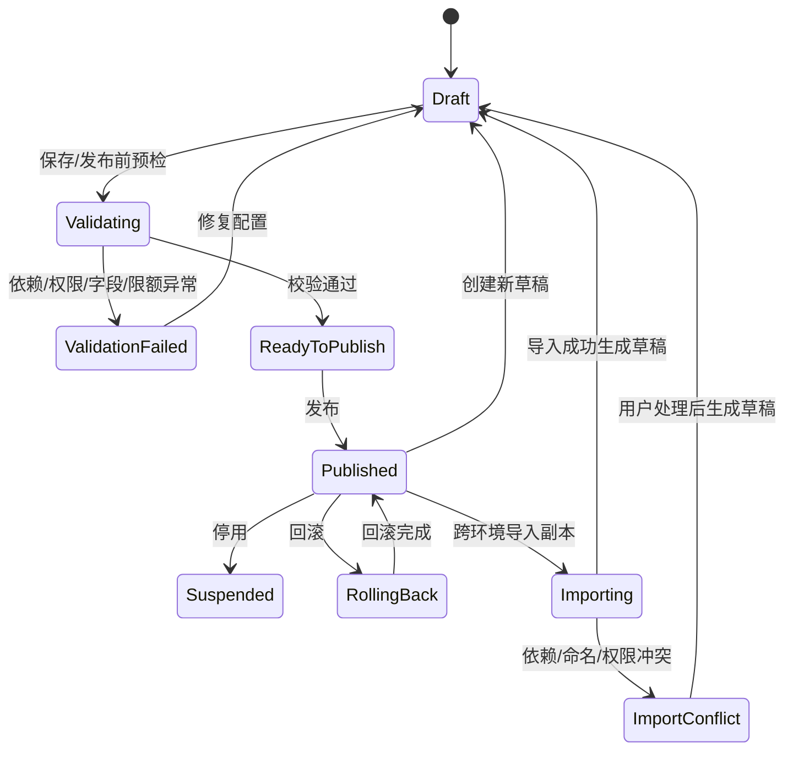
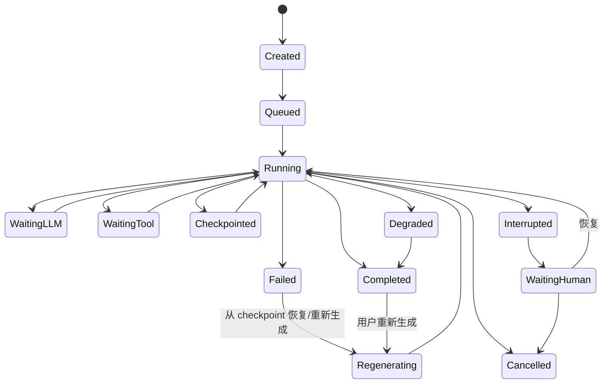
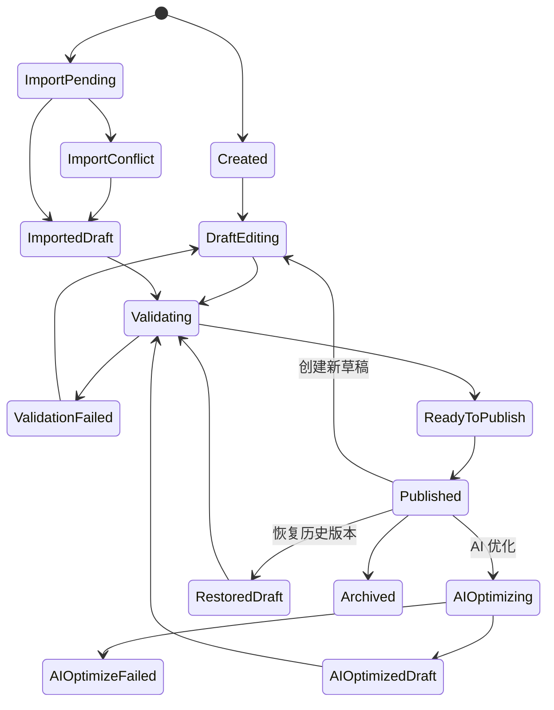
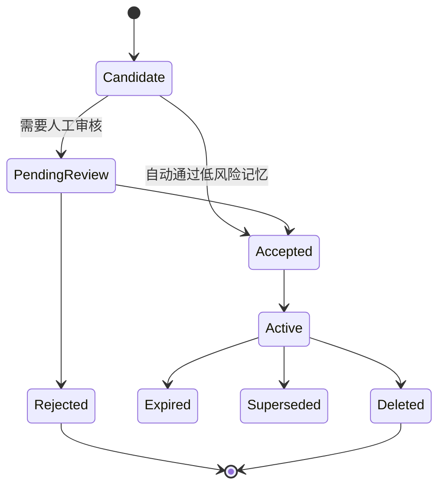
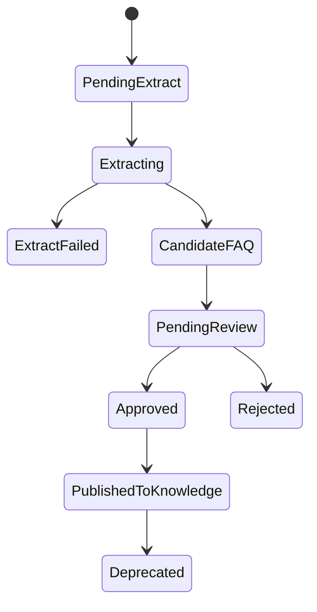

# UAgent 2026 年 7 月高级智能体需求补充设计：平台契约与 PRD 缺口

> 文件：`C:\Users\13609\.codex\workbase\chat_agent\agent_research\final\uagent_2026_07_advanced_agent_requirements_contract_design.md`  
> 日期：2026-07-06  
> 范围：仅基于 Teambition「产研团队」项目中 2026 年 7 月 AI / UAgent / 高级智能体相关任务、关联文档摘要，以及此前 Agent 平台调研设计文档进行产品设计补充。  
> 不包含：现有代码实现分析、接口代码方案、数据库实现细节、第三方源码再调研。  
> 目标：把当前 7 月研发任务上移成可评审、可拆解、可验收的高级智能体平台产品契约。

---

## 0. 一句话结论

当前 7 月高级智能体需求方向是对的，但它们更像「功能点 + 研发估时」集合，还没有形成平台级产品契约。

最需要补的不是继续新增零散任务，而是先补 4 份上游总设计：

1. **高级智能体能力模型总 PRD**  
   定义工具、MCP、Skill、外部智能体、子智能体、记忆、反思、护栏、人工审核、深度思考之间的对象关系、状态、权限、保存/发布规则。

2. **Agent Run 统一运行时模型 PRD**  
   定义 run、turn、message、trace node、checkpoint、parent run、异常、并发、重新生成、Diagnostic Analyzer 的统一状态机。

3. **Skill 生命周期统一模型 PRD**  
   定义 Skill、Draft、Version、Artifact、Reference、Execution Snapshot、AI 优化、跨环境导入、自动更新之间的关系。

4. **智能体知识与上下文体系 PRD**  
   定义 Memory、RAG、输入文件、FAQ、KCS/KM、向量索引、上下文拼装、审核、权限、评测之间的完整链路。

这 4 份总契约应该成为 7 月高级智能体平台底座建设的「上游规格」。否则会出现：功能都上线了，但配置互相打架、版本不可追溯、日志不可诊断、导入不可控、知识与记忆边界混乱。

---

## 1. 设计依据

### 1.1 Teambition 已读需求范围

本设计基于「产研团队」项目中 2026 年 7 月、团队为 AI、产品为 UAgent、主题为高级智能体相关任务与关联文档摘要。重点包括：

| 模块 | RD | 需求名称 |
|---|---:|---|
| Skill 生命周期 | RD-3057 | Skill 支持在线查看、编辑、下载文件 |
| Skill 版本 | RD-3058 | Skill 支持版本管理 |
| Skill AI 优化 | RD-3059 | 已有 Skill 支持 AI 优化 |
| 跨环境导入 | RD-3117 | 不同环境的智能体支持导入 |
| 运行观测 | RD-2900 | 高级智能体观测日志完善 |
| 异常/错误 | RD-815 / RD-941 | Agent 服务异常定义、检测、预警通知 / 高级智能体错误处理机制 |
| 并发 | RD-1016 | 高级智能体并发保障机制 |
| 重新生成 | RD-3119 | 高级智能体发布页支持重新生成 |
| Diagnostic | RD-3301 / RD-3487 | Agent Diagnostic Analyzer 测试 / 前端 |
| Memory | RD-379 / RD-1094 | 智能体记忆人工审核和筛选机制 / 智能体记忆迭代 |
| Context | RD-921 | 高级智能体上下文工程 |
| 输入文件 | RD-3054 | 高级智能体支持输入文件、图片 |
| FAQ 抽取 | RD-3122 | 常见问题抽取 CC 渠道调整 |
| KCS/KM | RD-3118 | KCS 同步 UAgent 开发单独接口 |
| 向量迁移 | RD-3399 / RD-3405 | 向量模型替换供应商 |
| 工具 | RD-706 | 高级智能体支持 UAgent 项目中已封装工具调用 |
| 外部智能体 | RD-714 / RD-715 | 高级智能体调用外部智能体 |
| Multi-Agent | RD-796 / RD-798 | Multi-Agent 创建相关子任务 |
| MCP | RD-3116 | MCP Server 使用量限制 |
| 租户体系 | RD-819 / RD-415 | 支持租户级用户体系 |
| 配置易用性 | RD-3109 / RD-3127 | 高级智能体配置易用性 |

### 1.2 已参考的前置调研设计

本设计同时吸收项目内已有调研文档的结论：

- `agent_platform_prd_blueprint.md`：UAgent 应定位为 Agent 生产、测试、发布、监控、治理平台，而不是 Prompt 配置后台。
- `uagent_detailed_feature_design.md`：平台 IA 应包含 Agent Studio、Skill Studio、Action Center、Knowledge、Eval、Trace、Release、Governance 等模块。
- `agent_runtime_detail_design_master.md`：运行时应覆盖流式输出、工具等待、多工具并行、多模态、Prompt 拼装、Memory、Reflection、Guardrail、Handoff、Long-running Task、Trace、成本控制、状态机等 40 个细节维度。
- `advanced_agent_patterns_detail_design.md`：高级 Agent 的差异在小机制，包括 Skill 渐进加载、tool strict schema、checkpoint/interrupt/resume、trace span/event、memory TTL/PII、eval regression 等。
- `skill_studio_interaction_detail_design.md`：Skill Studio 需要渐进式加载、渐进式披露、向导式创建、专家模式、沙箱验证、发布门禁。

---

## 2. 当前 7 月需求的整体诊断

### 2.1 已经做对的地方

当前排期不是空泛建设，已经覆盖高级智能体平台底座中的关键能力：

- Skill 文件编辑、下载、合规校验、版本、AI 优化。
- 高级智能体跨环境导入与依赖/冲突检测。
- Agent 观测日志事件链路，包括 guardrail、memory、skill、tool、LLM、responder、run_end。
- checkpoint 与重新生成的父子 run 关系。
- 记忆、上下文工程、输入文件、FAQ 抽取、KCS/KM 同步、RAG 检索工具。
- 向量模型供应商替换。
- UAgent 已封装工具调用、外部智能体调用、Multi-Agent 创建、MCP 限额、租户级用户体系。

这些点基本覆盖了「高级智能体能跑起来」所需的主要模块。

### 2.2 最大问题

最大问题是：**各 RD 以研发任务为中心，而不是以平台对象模型和运行契约为中心。**

具体表现：

1. **有功能入口，缺对象定义**  
   例如 Skill 支持编辑、版本、AI 优化、导入，但缺 Skill / Draft / Version / Artifact / Reference / Execution Snapshot 的统一定义。

2. **有节点日志，缺运行状态机**  
   RD-2900 的日志节点很完整，但缺 agent_run、turn、message、checkpoint、parent_run、trace_node 的统一关系。

3. **有知识/记忆/文件/RAG 任务，缺上下文资产体系**  
   记忆、输入文件、FAQ、KCS、RAG、向量索引分别在做，但没有回答「哪些内容进入上下文、哪些进入长期记忆、哪些进入知识库、冲突时谁优先」。

4. **有外部能力接入，缺可调用能力模型**  
   工具、MCP、Skill、外部智能体、子智能体都属于 Agent 可调用能力，但当前没有统一能力类型、权限、限额、失败策略和审计字段。

5. **有配置项，缺配置有效性机制**  
   配置易用性不只是把字段做成表单，而是需要预检、依赖提示、冲突提示、发布前风险摘要、运行影响解释。

### 2.3 设计原则

后续补需求时建议遵循 8 条原则：

1. **先定义对象，再定义页面。** 页面只是对象状态的表达。
2. **先定义状态机，再定义按钮。** 每个按钮都应该有前置状态、后置状态和失败态。
3. **先定义运行契约，再定义日志展示。** Trace 不是日志列表，而是运行时可诊断时间线。
4. **先定义权限与风险，再定义调用能力。** 工具、MCP、外部智能体和子智能体都可能越权或产生副作用。
5. **先定义上下文来源优先级，再定义 RAG/Memory/文件能力。** 否则答案来源混乱。
6. **先定义评测集，再定义 AI 优化。** 没有 baseline / regression 的 AI 优化只是重写文件。
7. **先定义跨环境可移植包，再定义导入按钮。** 导入本质是配置资产迁移，不是复制 JSON。
8. **先定义验收标准，再拆研发估时。** 否则上线后才发现不可验证。

---

# 3. 总契约一：高级智能体能力模型 PRD

## 3.1 目标

把高级智能体从「一堆配置项」定义成可保存、可校验、可发布、可导入、可运行、可追踪的完整产品对象。

## 3.2 高级智能体完整定义

建议高级智能体对象至少包含：

| 配置域 | 说明 | 典型来源 |
|---|---|---|
| Agent Profile | 名称、描述、负责人、业务目标、渠道、语气 | Agent Studio |
| Model Policy | 模型、温度、max token、fallback、成本策略 | 模型配置 |
| Prompt Policy | 系统提示词、开发者指令、动态变量、输出约束 | Prompt Studio |
| Skill References | 已绑定 Skill、版本策略、触发描述 | Skill Studio |
| Tool / Action References | 可调用工具、风险等级、确认策略 | Tool Center |
| MCP References | MCP Server、限额、鉴权、可见范围 | MCP Center |
| External Agent References | 外部智能体接入、输入输出、超时、失败策略 | 外部 Agent Center |
| Sub-Agent References | 子智能体、调用条件、上下文传递、结果回传 | Multi-Agent Studio |
| Knowledge / RAG | 知识源、检索策略、引用展示、权限过滤 | Knowledge Center |
| Memory Policy | 记忆抽取、召回、审核、过期、删除 | Memory Center |
| Reflection Policy | 反思触发条件、轮次、成本限制、禁用条件 | Runtime Policy |
| Guardrail Policy | 输入护栏、工具前护栏、工具后护栏、输出护栏 | Governance |
| Human Review Policy | 高风险动作审核、记忆审核、FAQ 审核 | HITL |
| Channel Policy | Web、IM、CC、移动端的输入输出差异 | Channel Center |
| Release Policy | 草稿、发布、灰度、回滚、环境导入 | Release Center |
| Observability Policy | Trace、日志脱敏、采样、保留周期 | AgentOps |

## 3.3 可调用能力统一模型

工具、MCP、Skill、外部智能体、子智能体在产品上都属于「Agent 可调用能力」。建议抽象成统一对象：

```text
CallableCapability
- capability_id
- capability_type: skill | tool | mcp_server | external_agent | sub_agent
- name
- description
- source: tenant | project | imported | external | system
- input_schema
- output_schema
- auth_policy
- permission_scope
- risk_level
- confirmation_policy
- quota_policy
- timeout_policy
- retry_policy
- fallback_policy
- audit_policy
- trace_policy
- status
- owner
- version / revision
```

这样可以统一解决：

- 配置页如何展示所有可用能力。
- LLM 如何知道哪些能力可调用。
- 运行时如何处理超时、失败、重试、确认、审计。
- 跨环境导入如何检测依赖和冲突。
- 租户权限如何限制能力可见和可执行。

## 3.4 高级智能体配置状态机



## 3.5 配置预检规则

发布前必须做统一预检，而不是各模块各自报错。

| 预检项 | 检查内容 | 失败处理 |
|---|---|---|
| 必填项 | 名称、模型、渠道、核心能力 | 阻断发布 |
| 依赖 | Skill、工具、知识库、MCP、外部 Agent 是否存在 | 阻断或留空确认 |
| 权限 | 当前租户/用户是否可用 | 阻断发布 |
| 鉴权 | 工具/MCP/外部 Agent 是否授权 | 阻断或提示授权 |
| 限额 | MCP/模型/工具调用额度是否足够 | 警告或阻断 |
| 风险 | 高风险工具是否有确认/审核策略 | 阻断 |
| 版本 | Skill/知识/模型是否固定版本或自动更新 | 警告说明 |
| Guardrail | 是否配置基础输入/输出护栏 | 警告或阻断 |
| Trace | 是否开启必要可观测字段 | 阻断生产发布 |

## 3.6 需要补的 RD

### PRD-A1：高级智能体能力模型总 PRD

交付物：

- 高级智能体完整配置 schema。
- 可调用能力统一模型。
- 配置状态机。
- 保存、校验、发布、停用、回滚、导入规则。
- 配置预检和错误码。

### PRD-A2：高级智能体配置预检与发布 PRD

交付物：

- 保存前轻量校验。
- 发布前完整预检。
- 风险摘要页。
- 依赖异常处理页。
- 发布失败恢复路径。

### PRD-A3：租户级权限与能力授权 PRD

交付物：

- 租户、用户、角色、资源、能力授权模型。
- 工具/MCP/外部 Agent/子 Agent/导入的权限传播规则。
- 审计字段与可见范围。

---

# 4. 总契约二：Agent Run 统一运行时模型 PRD

## 4.1 目标

把 Agent 的一次执行从「黑盒调用」变成可追踪、可诊断、可恢复、可重放、可分支的运行时对象。

## 4.2 核心对象

| 对象 | 含义 |
|---|---|
| AgentRun | 一次 Agent 执行的根对象，可包含多轮、多个节点、多个工具调用 |
| Turn | 用户的一轮输入与 Agent 回复过程 |
| Message | 用户/助手/系统/工具消息 |
| TraceNode | 运行时阶段节点，例如 run_start、llm_call、tool_call |
| Span | 有开始/结束时间的可观测区间 |
| Event | 某个瞬时事件，例如 token、重试、错误、状态变更 |
| Checkpoint | 可恢复/可重新生成的运行快照 |
| ParentRun | 重新生成/分支执行时的父 run |
| DiagnosticIssue | Analyzer 识别的问题对象 |

## 4.3 Agent Run 状态机



## 4.4 Trace 事件设计

RD-2900 已经列出较完整节点，建议升级为统一 Trace schema：

```text
trace_event
- event_id
- trace_id
- root_agent_run_id
- agent_run_id
- parent_agent_run_id
- turn_id
- message_id
- checkpoint_id
- node_type
- node_name
- node_status: pending | running | success | failed | skipped | degraded
- start_time
- end_time
- duration_ms
- input_summary
- output_summary
- raw_input_ref
- raw_output_ref
- error_type
- error_code
- error_message
- recoverable
- retry_count
- fallback_type
- token_input
- token_output
- cost
- latency_ttft_ms
- privacy_level
- redaction_status
- user_visible
- operator_action
```

## 4.5 RD-2900 节点补强建议

| 现有节点 | 已有设计 | 需要补充 |
|---|---|---|
| run_start | turn_id、message_id、入口、历史、摘要 | root_run_id、channel、用户/租户、版本快照 |
| input_guardrail | 检测内容、pass/block、规则、风险 | 修改/脱敏结果、命中证据、用户提示 |
| memory_recall | 策略、query、top_k、score、未召回原因 | 召回结果是否进入上下文、被截断原因 |
| skill_load | 来源、版本、预加载/动态加载 | resolved_version_id、auto_update 解析结果 |
| tool_reasoning | 候选工具、选择/停止原因 | 工具风险、是否需要确认、未选工具原因 |
| llm_call | request id、模型参数、token、TTFT、重试 | provider、fallback、成本、stream 状态 |
| tool_executor | 并行/串行、调度状态、超时/重试 | 幂等键、取消策略、并发等待时间 |
| tool_call | id、耗时、错误、脱敏、knowledge source | 输入 schema 校验、输出 schema 校验、风险等级 |
| responder | 最终回复、message_id、发送目标/状态 | 渠道渲染类型、流式状态、失败补偿 |
| memory_extract | 异步可观测、写入/丢弃原因 | 审核状态、PII 处理、是否影响后续回合 |
| run_end | 状态、耗时、token、工具数、降级/中断 | summary、diagnostic_issue、用户满意反馈关联 |

## 4.6 Checkpoint 与重新生成

RD-3119 已经提到 parent_agent_run_id、树状结构、checkpoint 改造、从 checkpoint 开始执行。需要进一步定义：

### 4.6.1 Checkpoint 生成时机

建议默认生成：

- 用户输入解析后。
- 工具调用前。
- 工具调用成功后。
- LLM 生成前。
- 输出护栏前。
- run failed / degraded / interrupted 时。

### 4.6.2 从 checkpoint 恢复时的复用规则

| 内容 | 默认策略 |
|---|---|
| 用户原始输入 | 复用 |
| 已确认槽位 | 复用，可编辑 |
| 已完成无副作用工具结果 | 可复用 |
| 已完成有副作用工具结果 | 默认不重放，只引用历史结果 |
| LLM 生成结果 | 重新生成 |
| Memory recall | 可重新召回，也可锁定原结果 |
| Guardrail 判断 | 重新执行 |
| 外部系统写操作 | 必须用户确认或幂等保护 |

### 4.6.3 父子 run 展示

前端不应只展示日志列表，应展示：

```text
原始 run
 ├─ 从 checkpoint A 重新生成 run-2
 ├─ 从失败节点恢复 run-3
 └─ 用户再次追问 run-4
```

每个子 run 应展示：

- 来源父 run。
- 起始 checkpoint。
- 与父 run 的差异。
- 新增工具调用。
- 新增成本。
- 最终状态。

## 4.7 Diagnostic Analyzer 产品定义

Diagnostic Analyzer 不应只是「日志查看器」，而应该输出诊断结论。

```text
DiagnosticIssue
- issue_id
- agent_run_id
- issue_type: tool_error | llm_error | guardrail_block | memory_miss | context_overflow | timeout | permission_denied | schema_error | degraded_quality
- severity: info | warning | error | critical
- evidence_trace_nodes
- root_cause_hypothesis
- user_impact
- recommended_action
- auto_recoverable
- related_config
- related_skill_version
- related_tool
- created_at
```

### 诊断示例

| 问题 | Analyzer 应输出 |
|---|---|
| 工具超时 | 哪个工具、超时时间、重试次数、是否有 fallback、是否影响最终回复 |
| 记忆未召回 | query、store、top_k、未召回原因、是否导致回答缺失 |
| 上下文超长 | 哪些内容被截断、截断策略、是否影响关键证据 |
| 输出被护栏拦截 | 命中规则、原始输出摘要、修改后输出、用户看到什么 |
| Skill 版本异常 | 加载的是哪个版本、是否自动更新、是否与编排选择一致 |

## 4.8 需要补的 RD

### PRD-B1：Agent Run 统一运行时模型 PRD

交付物：run / turn / message / trace node / checkpoint / parent run / diagnostic issue 定义。

### PRD-B2：Trace Timeline 交互 PRD

交付物：节点时间线、错误高亮、输入输出摘要、脱敏策略、父子 run、checkpoint、Analyzer 入口。

### PRD-B3：异常分类与恢复策略 PRD

交付物：异常类型、严重级别、检测条件、用户提示、后台告警、是否可重试、是否可从 checkpoint 恢复。

### PRD-B4：并发策略 PRD

交付物：同一用户、同一会话、同一 Agent、同一工具、同一 checkpoint 的并发规则。

### PRD-B5：Checkpoint 与重新生成 PRD

交付物：checkpoint 粒度、恢复规则、父子 run 树、分支对比、副作用工具幂等策略。

### PRD-B6：Diagnostic Analyzer PRD

交付物：Analyzer 输入字段、问题分类、证据节点、根因推断、建议动作、是否触发预警。

---

# 5. 总契约三：Skill 生命周期统一模型 PRD

## 5.1 目标

把 Skill 从「可编辑文件」升级为「可版本化、可评测、可发布、可导入、可优化、可追溯的平台资产」。

## 5.2 核心对象

```text
Skill
- skill_id
- skill_key
- name
- description
- owner
- source_type: manual | ai_created | ai_optimized | imported | restored
- origin_env
- origin_skill_id
- current_published_version_id
- latest_draft_id
- status

SkillDraft
- draft_id
- skill_id
- base_version_id
- edit_source: manual_edit | ai_optimize | restore | import_unpack
- file_tree
- dirty
- validation_status
- validation_errors
- lock_owner

SkillVersion
- version_id
- skill_id
- version_number
- package_hash
- manifest
- file_tree_snapshot
- runtime_config
- dependency_refs
- validation_result
- eval_result
- published_by
- published_at
- change_summary
- source_draft_id
- source_version_id

SkillReference
- reference_id
- agent_id
- skill_id
- version_policy: fixed | auto_update
- selected_version_id
- resolved_version_id
- last_resolved_at

ExecutionSnapshot
- agent_run_id
- skill_id
- resolved_version_id
- package_hash
- resolved_at
```

## 5.3 Skill 生命周期状态机



## 5.4 版本引用规则

### 固定版本 fixed

- 编排页选择某个具体版本。
- 新版本发布不影响该引用。
- AgentRun 创建时记录 resolved_version_id。
- 历史执行永远绑定当时版本。

### 自动更新 auto_update

- 每次新执行前解析最新可用 published version。
- 执行开始后固化 resolved_version_id。
- 执行中不受新发布影响。
- 回滚后是否跟随回滚版本，需要在发布策略中定义。

### 验收规则

- fixed 引用不随新版本变化。
- auto_update 只影响新执行。
- 已执行记录永远可追溯版本。
- 版本被归档后，已有执行仍可查看，新增执行不可选。

## 5.5 AI 优化 Skill 工作流

当前 RD-3059 提到 AI 优化按钮、导入沙箱、文件树、优化 agent、发布。建议补完整流程：

```text
选择基础版本
 -> 创建 AI 优化任务
 -> 沙箱解包
 -> 生成候选变更
 -> 展示 diff
 -> 用户选择接受/拒绝
 -> 保存为 AI 优化草稿
 -> 运行 lint / sandbox / eval
 -> 发布新版本
```

### AI 优化边界

- AI 不允许直接修改 published version。
- AI 优化结果必须成为 draft。
- 用户必须能查看 diff。
- 高风险脚本变更必须提示。
- 发布前必须通过同一套合规校验。
- AI 优化失败不得污染原草稿和已发布版本。

## 5.6 Skill 校验结果 schema

```text
ValidationResult
- validation_id
- skill_id
- draft_id
- status: passed | failed | warning
- errors[]
  - code
  - severity: blocking | warning | suggestion
  - source: syntax | sandbox | manifest | method | format | permission | dependency
  - file_path
  - line
  - column
  - message
  - fix_hint
  - auto_fix_available
```

## 5.7 Skill 渐进式加载设计

借鉴此前调研的 Anthropic/Codex Skills 机制，Skill 不应一次性全部注入上下文，而应分层加载：

| 层级 | 进入时机 | 内容 | 产品要求 |
|---|---|---|---|
| Metadata | 路由阶段始终可见 | name、description、trigger examples | 用于判断是否触发 Skill |
| Body | Skill 被触发后 | SKILL.md 主流程 | 控制长度，避免塞长 SOP |
| References | 按需读取 | SOP、API 文档、案例、术语表 | 必须说明何时读取 |
| Scripts | 执行时调用 | 确定性计算、格式化、校验 | 必须声明输入输出 schema |
| Assets/Templates | 按需使用 | 邮件模板、表格模板、图片等 | 不默认注入上下文 |

Skill Studio 页面应该展示：

- 每层 token / 长度风险。
- 哪些内容会进入模型上下文。
- 哪些内容只是可执行资源。
- references 的读取条件。
- scripts 的 schema 和安全校验结果。

## 5.8 跨环境导入

RD-3117 已覆盖分享码、完整定义、多个 set、依赖存在性、冲突检测。建议补 portable artifact 设计：

```text
AgentImportPackage
- package_id
- source_env
- source_agent_id
- export_time
- agent_definition
- skill_versions
- guardrails
- reflection_policy
- memory_policy
- tool_refs
- mcp_refs
- knowledge_refs
- external_agent_refs
- dependency_manifest
- checksum
```

### 冲突类型

| 冲突 | 处理方式 |
|---|---|
| 同名不同 ID | 复用 / 重命名 / 导入为新对象 / 跳过 |
| 同 origin ID 但版本不同 | 选择源版本 / 当前版本 / 新建版本 |
| 依赖缺失 | 显示缺失，允许映射或留空，但必须进入待修复列表 |
| 权限不足 | 阻断或请求管理员授权 |
| 密钥/鉴权不可迁移 | 留空并提示重新配置 |
| MCP/工具限额不兼容 | 警告或阻断发布 |
| Guardrail/反思策略不兼容 | 标记需人工确认 |

### 导入交互

```text
输入分享码
 -> 解析包
 -> 依赖预检
 -> 冲突列表
 -> 用户逐项处理
 -> 导入为草稿
 -> 发布前预检
 -> 导入结果报告
```

## 5.9 需要补的 RD

### PRD-C1：Skill 生命周期统一模型 PRD

交付物：Skill / Draft / Version / Artifact / Reference / Execution Snapshot 字段、状态机、规则。

### PRD-C2：Skill 版本引用与自动更新 PRD

交付物：fixed / auto_update 策略、运行时 resolved_version_id、历史执行追溯。

### PRD-C3：Skill AI 优化工作流 PRD

交付物：基础版本选择、AI 候选变更、diff、用户确认、校验、发布、失败回滚。

### PRD-C4：Skill 校验与发布门禁 PRD

交付物：校验项、错误 schema、前端定位、阻断规则、AI 修复入口。

### PRD-C5：跨环境导入依赖映射与冲突处理 PRD

交付物：导入包、依赖 manifest、冲突矩阵、映射 UI、导入报告。

---

# 6. 总契约四：智能体知识与上下文体系 PRD

## 6.1 目标

统一 Memory、RAG、输入文件、FAQ、KCS/KM、向量索引、上下文拼装、审核、权限、评测，避免各自建设后语义割裂。

## 6.2 上下文资产统一模型

```text
ContextSource
- source_id
- source_type: memory | knowledge_doc | input_file | faq | kcs_doc | km_doc | tool_result | conversation_history
- tenant_id
- agent_id
- user_scope
- permission_policy
- lifecycle_policy
- review_policy
- status

ContextItem
- item_id
- source_id
- content_summary
- raw_content_ref
- chunk_id
- score
- priority
- selected_for_prompt
- dropped_reason
- token_count
- citation_info

EmbeddingIndex
- index_id
- provider
- model_name
- dimension
- index_version
- source_scope
- created_at
- status
- rollback_index_id
```

## 6.3 上下文来源优先级

建议默认优先级：

1. 当前用户本轮输入。
2. 用户上传的当前会话文件。
3. 当前会话历史摘要。
4. 已审核长期记忆。
5. 与任务相关的 Skill body / references。
6. 企业知识库 / KCS / KM。
7. FAQ / 知识发现结果。
8. 工具返回结果。
9. 低置信度候选记忆或未审核知识默认不进入最终回答，只用于提示或待审核。

实际拼装时应按 token budget、权限、置信度、时效性和渠道约束动态裁剪。

## 6.4 Memory 生命周期



### Memory 字段

```text
Memory
- memory_id
- tenant_id
- agent_id
- user_id / account_id
- memory_type: preference | fact | constraint | history | relationship | risk
- source_conversation_id
- source_message_id
- content
- confidence
- pii_level
- review_status
- reviewer
- review_reason
- effective_scope: user | agent | tenant
- ttl
- created_at
- updated_at
- deleted_at
```

### Memory 触发时机

| 时机 | 是否建议默认开启 | 说明 |
|---|---|---|
| 每轮对话后异步抽取 | 可开启，但需策略限制 | 低风险偏好/事实可候选，敏感信息需审核 |
| 用户显式要求记住 | 建议开启 | 用户授权更明确 |
| 人工客服标记 | 建议支持 | 客服主管/运营可沉淀高价值记忆 |
| 工具返回结果 | 谨慎 | 只记可长期使用事实，避免短期状态污染 |
| FAQ/KCS 文档 | 不进入 Memory | 应进入 Knowledge，而不是用户记忆 |

## 6.5 输入文件产品契约

RD-3054 已有上传入口、预览调试、发布页 PC/移动端、接口适配、大模型调用适配。需要补：

| 设计项 | 规则 |
|---|---|
| 文件类型 | 文档、图片、表格、PDF、文本等类型分级支持 |
| 生命周期 | 本轮有效 / 会话有效 / Agent 配置附件 / 可沉淀知识 |
| 解析状态 | 上传中、解析中、成功、部分成功、失败、过期 |
| RAG 关系 | 是否分片、是否向量化、是否参与检索 |
| Memory 关系 | 默认不写长期记忆，除非用户确认或规则允许 |
| 权限 | 文件默认属于上传用户/会话，沉淀知识需权限确认 |
| 删除 | 删除后原文、分片、索引都要不可检索 |
| 引用 | 回答中可展示来源文件和片段 |

## 6.6 FAQ 抽取与知识发现

RD-3122 已覆盖 IM/CC 渠道、消息格式、FAQ 抽取、提示词优化、知识聚类、Udesk 下拉。需要补状态机：



### FAQ 质量指标

- 重复率。
- 聚类纯度。
- 误合并率。
- 问法覆盖率。
- 答案可用率。
- 人工采纳率。
- 发布后命中率。
- 发布后负反馈率。

## 6.7 KCS/KM 同步契约

RD-3118 已有文档解析、删除、状态接口、分片迁移、并发控制、KCS/KM 联调。需要补：

| 设计项 | 规则 |
|---|---|
| 事实源 | 明确 KCS/KM/UAgent 谁是 source of truth |
| 同步状态 | 待同步、同步中、成功、失败、重试中、删除中、冲突 |
| 文档版本 | 支持版本号、更新时间、增量解析 |
| 删除语义 | 源文档删除后 UAgent 是否立即不可检索 |
| 分片契约 | 分片大小、标题继承、元数据、权限、来源追溯 |
| 幂等 | 重复同步不会生成重复文档/重复索引 |
| 权限 | 原 ACL 是否同步到 UAgent 检索过滤 |

## 6.8 向量模型迁移

RD-3399/RD-3405 的「供应商到期、所有调用处替换、所有 set 替换」风险很高。向量迁移不是换接口，而是知识召回系统迁移。

### 必补设计

| 项 | 说明 |
|---|---|
| 迁移清单 | 知识库、FAQ、输入文件分片、记忆、历史索引、测试集 |
| Provider 抽象 | 禁止业务直接调用供应商，统一 embedding provider 层 |
| 索引版本 | 旧索引、新索引可并存，可按租户/知识集切换 |
| 重建策略 | 全量重建 / 增量重建 / 双写 / 灰度 |
| 质量对比 | TopK 重合率、业务问答通过率、召回率、排序质量 |
| 回滚 | 新模型效果不达标时可切回旧索引 |
| 成本/延迟 | 迁移成本、线上延迟、批处理耗时 |
| Deadline | 供应商到期前迁移窗口和冻结期 |

## 6.9 Context Engineering

RD-921 不能只写「看 Deep Agents 是否可复用」。需要产品化定义：

### Prompt 拼装顺序

```text
System / Developer Policy
 -> Agent Profile
 -> Channel Policy
 -> Guardrail Policy
 -> Current Task / User Message
 -> Selected Skill Body
 -> Required References
 -> Retrieved Knowledge
 -> Retrieved Memory
 -> Tool Results
 -> Output Schema
```

### Token Budget

| 内容 | 预算策略 |
|---|---|
| 系统/开发者策略 | 固定保留 |
| 当前用户输入 | 高优先级保留 |
| Skill body | 触发后保留核心部分 |
| References | 按需摘要/截断 |
| RAG | top_k + rerank + token cap |
| Memory | 仅高相关、已审核、未过期 |
| 历史消息 | 摘要优先，必要原文 |
| 工具结果 | 结构化摘要，原文按需引用 |

## 6.10 需要补的 RD

### PRD-D1：UAgent 智能体知识与上下文体系产品契约

交付物：ContextSource / ContextItem / EmbeddingIndex / ReviewItem 模型、上下文来源优先级、权限和生命周期。

### PRD-D2：Memory 生命周期与人工审核 PRD

交付物：候选、审核、采纳、拒绝、过期、删除、冲突处理、调试可见性。

### PRD-D3：Context Engineering PRD

交付物：Prompt 拼装顺序、token budget、长上下文策略、Deep Agents 启用边界、回退策略。

### PRD-D4：输入文件产品契约 PRD

交付物：文件类型/大小/数量、生命周期、解析状态、错误交互、RAG/Memory 关系、移动端差异。

### PRD-D5：FAQ 抽取与知识发现 PRD

交付物：渠道字段映射、FAQ 状态机、人工确认、聚类质量指标、Udesk 下拉交互。

### PRD-D6：KCS/KM 同步状态机与数据契约 PRD

交付物：同步、删除、版本、分片、并发、失败重试、状态展示、事实源关系。

### PRD-D7：向量模型迁移方案 PRD

交付物：迁移范围、索引版本、双写/灰度/回滚、质量对比集、上线窗口。

---

# 7. 对现有 7 月 RD 的补洞建议

## 7.1 应先补的 10 项

| 优先级 | 建议补充 | 覆盖 RD | 原因 |
|---:|---|---|---|
| 1 | 高级智能体能力模型总 PRD | RD-706/714/796/819/3109/3117 | 所有配置能力的上游契约 |
| 2 | Agent Run 统一运行时模型 PRD | RD-2900/815/941/1016/3119 | Trace、错误、并发、重生成共用底座 |
| 3 | Skill 生命周期统一模型 PRD | RD-3057/3058/3059/3117 | 避免编辑、版本、AI 优化、导入互相冲突 |
| 4 | 知识与上下文体系 PRD | RD-379/921/1094/3054/3122/3118/3399 | Memory/RAG/文件/FAQ/KCS 边界必须统一 |
| 5 | 配置预检与发布 PRD | RD-3109/3117 | 配置复杂后必须可校验、可解释 |
| 6 | Trace Timeline + Diagnostic Analyzer PRD | RD-2900/3301/3487 | 从日志展示升级为问题诊断 |
| 7 | Checkpoint 与重新生成 PRD | RD-3119 | 防止重新生成破坏副作用工具和版本追溯 |
| 8 | 向量模型迁移 PRD | RD-3399/3405 | 供应商到期是硬风险，不能当普通接口替换 |
| 9 | Multi-Agent 协作 PRD | RD-796/798/714 | 创建子智能体不等于有协作协议 |
| 10 | Skill 校验/评测/AI 优化闭环 PRD | RD-3057/3059 | AI 优化必须有 diff、eval、发布门禁 |

## 7.2 哪些现有任务需要补验收标准

### RD-2900 高级智能体观测日志完善

需要补：

- trace_id / run_id / parent_run_id / checkpoint_id 的关联规则。
- 每个节点状态、耗时、错误、重试、脱敏、用户可见性。
- 前端 Timeline 交互，而不是仅「各节点展示」。
- Diagnostic Analyzer 的输入字段。

### RD-3057 Skill 在线查看/编辑/下载

需要补：

- 编辑对象是草稿还是历史版本副本。
- 下载对象是草稿、当前发布版本还是指定历史版本。
- 文件树操作范围、保存策略、多人编辑冲突。
- 校验错误定位到文件/行号。

### RD-3058 Skill 版本管理

需要补：

- fixed / auto_update 版本引用策略。
- execution snapshot 固化版本。
- 历史版本不可变。
- 恢复历史版本是生成草稿还是发布新版本。

### RD-3059 已有 Skill AI 优化

需要补：

- AI 优化必须生成候选草稿。
- 用户可看 diff。
- 优化失败不污染原版本。
- 优化后必须跑校验和评测。

### RD-3117 不同环境智能体导入

需要补：

- 导入包 schema。
- 依赖 manifest。
- 冲突矩阵。
- 缺失依赖处理。
- 导入结果报告。
- 密钥/鉴权不可迁移规则。

### RD-921 上下文工程

需要补：

- 上下文拼装顺序。
- token budget。
- 长上下文 vs RAG vs Memory 的启用策略。
- Deep Agents 引入边界和回退策略。
- context assembly 可观测性。

### RD-1016 并发保障机制

需要补：

- 同一会话并发策略。
- 同一用户多设备并发策略。
- 同一工具副作用调用并发策略。
- queue / cancel / branch / reject / dedupe 的选择规则。
- 幂等键和 trace 记录。

### RD-3399/RD-3405 向量供应商替换

需要补：

- embedding provider 抽象。
- 索引版本并存。
- 重嵌入任务进度。
- 灰度切流。
- 质量对比集。
- 回滚方案。

---

# 8. 建议的 7 月排期重组方式

## 8.1 从「功能任务」重组为「底座契约 + 功能实现」

建议把 7 月高级智能体建设拆成两层：

### 第一层：底座契约，必须先评审

1. 高级智能体能力模型。
2. Agent Run 运行时模型。
3. Skill 生命周期模型。
4. 知识与上下文体系模型。
5. 权限 / 发布 / 导入 / 预检统一规则。

### 第二层：功能实现，按契约落地

1. Skill 编辑、版本、AI 优化、导入。
2. Trace Timeline、Diagnostic Analyzer、异常预警。
3. Memory、RAG、输入文件、FAQ、KCS 同步。
4. 工具、MCP、外部智能体、Multi-Agent。
5. 配置易用性与发布体验。

## 8.2 推荐迭代顺序

### 第一优先：可运行、可诊断、可回滚

- Agent Run 统一模型。
- Trace Timeline。
- Checkpoint / 重新生成。
- 错误与并发策略。

原因：没有运行时诊断，后续所有能力上线后都难排查。

### 第二优先：Skill 资产化

- Skill 生命周期。
- 版本引用。
- 在线编辑/校验。
- AI 优化。
- 跨环境导入。

原因：当前平台基本流程依赖 Skill，Skill 不资产化，高级智能体就会变成工程师手工交付。

### 第三优先：知识与上下文统一

- Memory 生命周期。
- Context Engineering。
- 输入文件。
- KCS/KM 同步。
- FAQ 抽取。
- 向量迁移。

原因：这些能力直接影响回答质量，但必须统一边界，否则会互相污染。

### 第四优先：外部能力与多智能体

- 可调用能力模型。
- 工具/MCP 限额。
- 外部智能体调用契约。
- Multi-Agent 协作协议。
- 租户权限。

原因：能力越外部化，风险越高，必须建立在权限、Trace、发布门禁之上。

---

# 9. 给 PM / 研发 / 测试的使用方式

## 9.1 PM 如何使用

每个 RD 评审前问 6 个问题：

1. 这个需求涉及哪个核心对象？对象字段定义了吗？
2. 这个需求改变哪个状态？状态机定义了吗？
3. 用户在哪个页面感知？失败态和空态定义了吗？
4. 运行时如何记录 Trace？可诊断吗？
5. 是否涉及权限、风险、审核、脱敏、成本？
6. 验收样例是什么？通过/失败标准是什么？

## 9.2 研发如何使用

每个实现前确认：

- 是否有稳定 ID 和版本字段。
- 是否有幂等键。
- 是否有状态字段。
- 是否有错误码和错误类型。
- 是否有 trace event。
- 是否有权限校验点。
- 是否有回滚/恢复策略。
- 是否有单测/集成测试/回归测试样例。

## 9.3 测试如何使用

测试不应只测页面和接口成功，而要测：

- 状态机流转。
- 异常/超时/重试/降级。
- 版本追溯。
- 跨环境导入冲突。
- 权限隔离。
- Trace 完整性。
- AI 优化前后差异。
- 向量迁移前后召回质量。

---

# 10. 最小可交付定义

如果 7 月只能补最小闭环，建议定义为：

1. 一个高级智能体配置可以被完整保存、回显、预检、发布。
2. 一个 Skill 可以被编辑、校验、发布版本、被固定版本引用、被执行快照追溯。
3. 一次 AgentRun 可以从 run_start 到 run_end 被完整 trace，并能定位失败节点。
4. 一次失败 run 可以基于 checkpoint 重新生成，并保留 parent-child 关系。
5. 记忆、文件、知识、FAQ 至少能区分来源、权限、审核状态和是否进入上下文。
6. 跨环境导入可以列出缺失依赖、冲突项和处理结果，不静默留空。
7. 向量模型迁移有新旧索引质量对比和回滚方案。

---

# 11. 结论

当前 7 月高级智能体需求已经覆盖了很多正确方向，但它们还没有形成「平台底座」的产品语言。

真正要补的是：

- **对象模型**：Agent、Skill、Run、Context、Capability。
- **状态机**：配置、发布、执行、恢复、审核、导入、同步、迁移。
- **契约**：字段、权限、版本、trace、错误、评测、发布门禁。
- **交互**：预检、时间线、diff、冲突处理、诊断、风险摘要。
- **验收**：不只测能不能用，还要测能不能追溯、恢复、回滚、解释、治理。

如果按本文补齐上游设计，7 月需求可以从「一批研发任务」升级为「高级智能体平台底座建设」。这才是 UAgent 从配置后台走向企业级 Agent 平台的关键一步。
